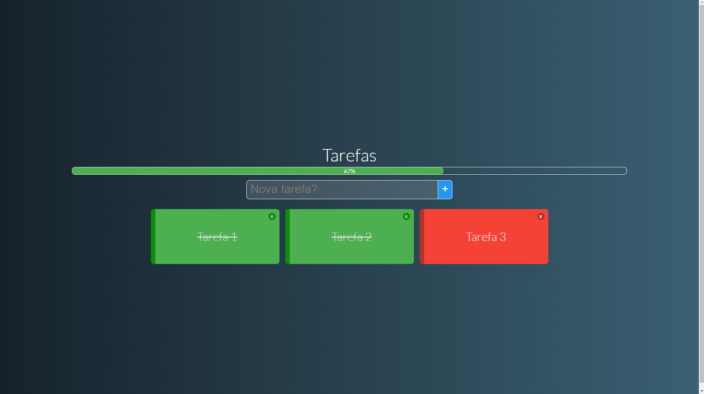

# tarefas

Essa aplicação é tipo um todo-list, onde podemos cadastrar tarefas, os card's vermelhos são tarefas a fazer, e o card verde são tarefas concluídas.

# Recursos

* O aplicativo foi desenvolvido com JavaScrip, CSS, HTML e Vue 2.

# Uso

1. Clone o repositório do GitHub.
2. Abra o projeto no seu editor de código.
3. Instale o pacote do projeto com npm install.
3. Starte o projeto com npm run serve.

# Créditos

Este projeto foi criado por Alaska Websites.